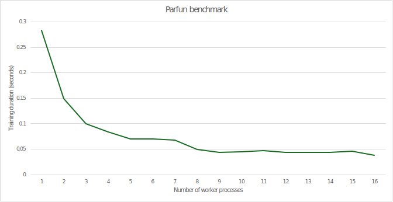

<div align="center">
  <a href="https://github.com/citi">
    
  </a>

  <h3 align="center">Citi/Parfun</h3>

  <p align="center">
    Lightweight parallelization library for Python.
  </p>

  <p align="center">
    <a href="https://citi.github.io/parfun/">
      
    </a>
    <a href="./LICENSE">
      
    </a>
    <a href="https://pypi.org/project/parfun/">
      
    </a>
    
  </p>
</div>

<br />

Parfun is a lightweight library **making it easy to write and run Python in parallel and distributed systems**.

The main feature of the library is its `@parallel` decorator that transparently executes standard Python functions in parallel
following the [map-reduce](https://en.wikipedia.org/wiki/MapReduce) pattern:

```Python
from typing import List

import parfun as pf


@pf.parallel(
    # parallelize by chunking the argument list (map)
    split=pf.per_argument(
        values=pf.py_list.by_chunk
    ),

    # merge the output by concatenating the results (reduce)
    combine_with=pf.py_list.concat,
)
def list_pow(values: List[float], factor: float) -> List[float]:
    """compute powers of a list of numbers"""
    return [v**factor for v in values]


if __name__ == "__main__":
    with pf.set_parallel_backend_context("local_multiprocessing"):  # use a local pool of processes
        print(list_pow([1, 2, 3], 2))  # runs in parallel, prints [1, 4, 9]
```

## Features

* **Provides significant speedups** to existing Python functions.
* **Only requires basic understanding of parallel and distributed computing systems**.
* **Automatically estimates the optimal sub-task splitting strategy** (the *partition size*).
* **Transparently handles data transmission, caching, and synchronization**.
* **Supports various distributed computing backends**:
  * Python's built-in [multiprocessing module](https://docs.python.org/3/library/multiprocessing.html).
  * [Scaler](https://github.com/citi/scaler).
  * [Dask](https://www.dask.org/).

## Quick Start

Install Parfun directly from PyPI:

```bash
pip install parfun
pip install "parfun[pandas,scaler,dask]"  # with optional dependencies
```

The official documentation is available at [citi.github.io/parfun/](https://citi.github.io/parfun/).

Take a look at our documentation's [quickstart tutorial](https://citi.github.io/parfun/tutorials/quickstart.html) to get
more examples and a deeper overview of the library.

Alternatively, you can build the documentation from source:

```bash
cd docs
pip install -r requirements.txt
make html
```

The documentation's main page can then be found at `docs/build/html/index.html`.

## Benchmarks

**Parfun effectively parallelizes even short-duration functions**.

For example, when running a short 0.28-second machine learning function on an AMD Epyc 7313 16-Core Processor, we found that Parfun
provided an impressive **7.4x speedup**. Source code for this experiment [here](examples/california_housing/main.py).



## Contributing

Your contributions are at the core of making this a true open source project. Any contributions you make are **greatly appreciated**.

We welcome you to:

* Fix typos or touch up documentation
* Share your opinions on [existing issues](https://github.com/citi/parfun/issues)
* Help expand and improve our library by [opening a new issue](https://github.com/citi/parfun/issues/new)

Please review our [community contribution guidelines](https://github.com/Citi/.github/blob/main/CONTRIBUTING.md) and
[functional contribution guidelines](./CONTRIBUTING.md) to get started 👍.

## Code of Conduct

We are committed to making open source an enjoyable and respectful experience for our community. See
[`CODE_OF_CONDUCT`](https://github.com/Citi/.github/blob/main/CODE_OF_CONDUCT.md) for more information.

## License

This project is distributed under the [Apache-2.0 License](https://www.apache.org/licenses/LICENSE-2.0). See
[`LICENSE`](./LICENSE) for more information.

## Contact

If you have a query or require support with this project, [raise an issue](https://github.com/Citi/parfun/issues).
Otherwise, reach out to [opensource@citi.com](mailto:opensource@citi.com).
