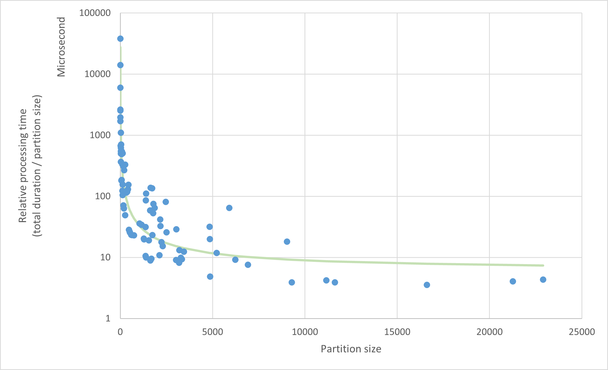

Implementation details
======================

.. note::

    This section provides additional design insights on how we designed the Parfun library. **Most users should not be
    required to go through this section in detail**.

Design goals
------------

* Distributes the computation of parallelized functions on **multiple servers**.
* Users of the decorator **shall not be required to know anything about the underlying infrastructure**.
* The system should **automatically determine the optimal partition size**.

Implementation
--------------

Our distributed system **relies on either a local or a distributed worker pool to manage and execute tasks** on multiple
machines (see the :py:class:`~parfun.backend.mixins.BackendEngine` interface).

**This parallel engine is responsible of queuing and executing the partitioned tasks**. The library relies on
**heuristics to determine the ideal partition size** based on feedback from the previously executed tasks.

Partition size estimation
-------------------------

The partition size is being determined by the library by probing the execution of the function on some range of
partition sizes. This is called the **learning phase**.

Once an optimal partition size has been found, the library will start generating partitions that are close to that size.

There are multiple ways of determining an optimal partition size, depending on what constraints you wish to optimize.
**We designed our partition size estimator so that it finds a partition size that provides decent parallelism without
overusing too much computing resources**. In other words, our estimator will prefer a 10x speedup that requires 15 cores
to a 12x speedup that requires 50 cores.

To estimate the optimal partition size, we first have to look at **how parallel execution durations change with respect
to partition sizes**. If we look at the execution trace of our ``relative_metrics()`` function:

.. image:: images/partition_size_estimator_graph_1.png

**We observe that the relative processing speed (i.e., the time to process one dataset row) drops dramatically with
greater partition sizes, but stabilizes around a partition size of about 3000** (graph is log scale). This tells us that
smaller partition sizes cause too much overhead (code initialization, input preprocessing ...), while partition sizes
above a few thousands do not significantly reduce the overhead.

Mathematically, we could fit a linear function ``f(partition_size) = α + β / partition_size``, where ``α`` would be the
time it takes to process one row, and ``β`` the function scheduling and initialization duration:

Knowing these ``α`` and ``β`` parameters, the partition size estimator finds a partition size that satisfies these two
constraints:

* **The function initialization time (** ``β`` **) should be less than 5% of the total execution time**. This ensures
  that we are not parallelizing to much at the expense of computing resources.

* **The processing of a single partition should at least exceed the CPU time required to schedule the task**. There is
  some non-measured overhead (IPC, OS task management) that will make parallelization of short tasks inefficient.

Based on these constraints, the estimator suggests a partition size of about 2000 for our example function.
