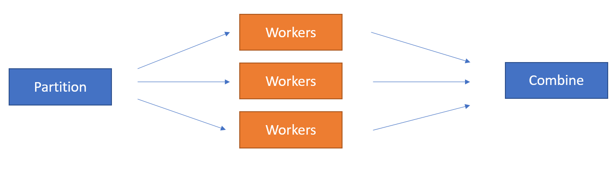

Quick start
===========

When to use it
--------------

**Parfun** works well with computations that are CPU intensive and that can be easily portioned in independent
sub-tasks.

Here are a few examples of computations that can be easily parallelized:

* ✔ Filtering tasks (e.g. :py:func:`pandas.Dataframe.filter`)
* ✔ Commutative mathematical operations (e.g. some matrix operations, ...)
* ✔ By-row data processing tasks (e.g. input preprocessing).

Other tasks cannot easily be parallelized:

* ✖ Computations that require non-partitionable datasets (e.g. median computation, sorting)
* ✖ I/O intensive tasks (file loading, network communications)
* ✖ Very short (< 100ms) tasks. These tasks are two small for the parallelism gains to exceed the system overhead
  caused by our parallelization system (e.g. system communications and initialization).

Setup
-----

First, add the ``parfun`` package to your *requirements.txt* file, or install it using PIP:

.. code:: bash

    pip install parfun

The command here-above will **only install the base package**. If you wish to use the Scaler or Dask distributed
backends, or to enable Pandas' support, use the `scaler`, `dask` and/or `scaler` extras:

.. code:: bash

    pip install parfun[dask,scaler,pandas]

The library relies on a registered computing backend to schedule and distribute sub-tasks among a group of allocated
workers.

**Before using the library, the user should select the backend instance to use**. This can either be done process wise
with the :py:func:`~parfun.entry_point.set_parallel_backend` or within a Python context with
:py:func:`~parfun.entry_point.set_parallel_backend_context`.

.. code:: python

    from parfun.entry_point import set_parallel_backend, set_parallel_backend_context

    # Set the parallel backend process-wise.
    set_parallel_backend("local_multiprocessing")

    # Set the parallel backend with a Python context.
    with set_parallel_backend_context("scaler_remote", scheduler_address="tcp://scaler.cluster:1243"):
        ... # Will run with parallel task over Scaler.

See :py:func:`~parfun.entry_point.set_parallel_backend` for a description of the available backend options.

Your first parallel function
----------------------------

Let's say that you have a computing intensive function that applies on a large dataframe, but that actually **does the
computations separately for each country**:

.. code-block:: python

    def relative_metrics(df: pd.DataFrame, columns: List[str]) -> pd.DataFrame:
        """
        Computes relative metrics (difference to mean, median ...) of a dataframe, for each of the requested dataframe's
        values, grouped by country.
        """

        output = df.copy()

        for country in output["country"].unique():
            for column in columns:
                values = output.loc[output["country"] == country, column]

                mean = values.mean()
                std = values.std()

                output.loc[output["country"] == country, f"{column}_diff_to_mean"] = values - mean
                output.loc[output["country"] == country, f"{column}_sq_diff_to_mean"] = (values - mean) ** 2
                output.loc[output["country"] == country, f"{column}_relative_to_mean"] = (values - mean) / std

        return output

    print(df)
    #       company       industry country     market_cap       revenue  workforce
    # 0       Apple     technology      US  2828000000000  397000000000     161000
    # 1        ASML     technology      NL   236000000000   27180000000      39850
    # 2  Volkswagen  manufacturing      DE    55550000000  312000000000     650951
    # 3   Citigroup        banking      US    80310000000   79840000000     240000
    # 4     Tencent  manufacturing      CN   345000000000   79000000000     104503
    #           ...            ...     ...            ...           ...        ...

    print(relative_metrics(df, ["market_cap", "revenue", "workforce"]))
    #       company       industry country     market_cap       revenue  workforce  workforce_diff_to_mean  workforce_sq_diff_to_mean
    # 0       Apple     technology      US  2828000000000            10     161000                   -3520               1.560250e+09  ...
    # 1        ASML     technology      NL   236000000000   27180000000      39850                  -19710               2.372191e+00  ...
    # 2  Volkswagen  manufacturing      DE    55550000000  312000000000     650951                   83091               9.291912e+00  ...
    # 3   Citigroup        banking      US    80310000000            10     240000                   13200               1.560250e+09  ...
    # 4     Tencent  manufacturing      CN   345000000000   79000000000     104503                   11201               0.127128e+00  ...
    #           ...            ...     ...            ...           ...        ...

When executing the function on a large dataframe, **it takes a little bit more than 3.7 seconds to complete**:

.. code-block:: console

    In [11]: %timeit relative_metrics(df, metric_columns)
    3.72 s ± 42.5 ms per loop (mean ± std. dev. of 7 runs, 1 loop each)

Modern computers usually have multiple computing units, or cores. **These cores excel when computing data-independent
tasks**.

Ideally, we could leverage these computing resources by **partitioning calls** to ``relative_metrics()`` for each
``country`` group, and by executing these on different cores. Note that there is only data dependency within these group
computations (``mean()``, ``std()``).

Our ideal parallel computation will thus look like this:

.. image:: images/parallel_function.png

This architecture is a well-known **parallelization pattern named map/reduce** or scatter/gather. **We introduce a new**
:py:func:`~parfun.decorators.parfun` **decorator** that you can use to easily distribute the computation of functions
with minimal code change or knowledge of the underlying computing architecture.

The decorator requires the user to specify how to partition the input data (which arguments, and how these should be
partitioned), and how to combine the resulting sub-results:

.. code-block:: python

    from parfun import parfun
    from parfun.combine.dataframe import df_concat
    from parfun.partition.api import per_argument
    from parfun.partition.dataframe import df_by_group

    @parfun(
        split=per_argument(df=df_by_group(by="country"))
        combine_with=df_concat,
    )
    def relative_metrics(df: pd.DataFrame, columns: List[str]) -> pd.DataFrame:
        ...

Without changing anything to our function implementation, we immediately benefit from significantly reduced computing
times:

.. code-block:: console

    In [13]: %timeit relative_metrics(df, metric_columns)
    1.23 s ± 44.2 ms per loop (mean ± std. dev. of 7 runs, 1 loop each)

**Our function is now 3x faster!** 🎉

Advanced partitioning
---------------------

As seen in the example here-above, the ``@parfun`` decorator accepts a partitioning function (``split``), and a
combining function (``combine_with``).

Parfun provides an :doc:`extensive set of partitioning function and helpers</api/partition>`.

Previously, we applied a single partitioning function (:py:func:`~parfun.partition.dataframe.df_by_group`) on a
single argument. However, we could also use :py:func:`~parfun.partition.api.per_argument` to apply different
partitioning functions on various parameters:

.. code-block:: python

    from parfun import parfun
    from parfun.partition.api import per_argument
    from parfun.partition.collection import list_by_chunk
    from parfun.partition.dataframe import df_by_row

    @parfun(
        split=per_argument(
            values=list_by_chunk,
            df_1=df_by_row,
            df_2=df_by_row,
        )
        ...
    )
    def func(values: List, df_1: pd.DataFrame, df_2: pd.DataFrame)
        ...

We are using two partitioning functions, :py:func:`~parfun.partition.collection.list_by_chunk` and
:py:func:`~parfun.partition.dataframe.df_by_row`. These splits the arguments in equally sized partitions. It's
semantically equivalent to iterating all these partitioned arguments simultaneously:

.. code-block:: python

    size = min(len(values), df_1.shape[0], df_2.shape[0])
    for begin in range(0, end, PARTITION_SIZE):
        end = min(begin + PARTITION_SIZE, size)
        func(values[begin:end], df_1.iloc[begin:end], df_2.iloc[begin:end])

Alternatively, it might be sometimes desired to run the same partitioning function on all parameters simultaneously with
:py:func:`~parfun.partition.api.all_arguments`:

.. code-block:: python

    from parfun import parfun
    from parfun.partition.api import all_arguments
    from parfun.partition.dataframe import df_by_row

    @parfun(
        split=all_arguments(df_by_group(by=["year", "month"]))
    )
    def func(df_1: pd.DataFrame, df_2: pd.DataFrame):
        ...

Custom partition generators
~~~~~~~~~~~~~~~~~~~~~~~~~~~

If you wish to implement more complex partitioning schemes, ``parfun`` allows the use of custom Python generators:

.. code:: python

    def partition_by_week(df: pd.DataFrame) -> Generator[Tuple[pd.DataFrame]]:
        for _, partition in df.groupby(by=df["year-day"] // 7):
            yield partition,  # Should always yield a tuple that matches the input parameters.

    @parfun(
        split=all_arguments(partition_by_week),
        ...
    )
    def func(df: pd.DataFrame):
        ...

To work properly, custom generators should:

1. **use the** ``yield`` **mechanism**, and not return a collection (e.g. a list). Returning a collection instead of
   using a generator will lead to deteriorated performances and higher memory usage.
2. **accept the parameters to partition, and yield these partitioned parameters as a tuple**, in the same order.

When used with ``per_argument``, multiple custom generators can be mixed with pre-defined generators, or with other
customer generators.

Partition size estimate
~~~~~~~~~~~~~~~~~~~~~~~

The library tries to automatically determine the optimal size for the parallelly distributed partitions.

:doc:`Read more </tutorials/implementation_details>` about how the library computes the optimal partition size.

**You can override how the library choose the partition size to use by either providing either the**
``initial_partition_size: int`` **or** ``fixed_partition_size: int`` **parameter:**

.. code:: python

    @parfun(
        ...,
        fixed_partition_size=10,  # The partition size will always be 10 rows/items.
        ...
    )

    @parfun(
        ...,
        initial_partition_size=200,  # The library will use 200 as a first estimate then improve from it.
        ...
    )

These parameters also accept a callable instead of an ``int``. This is useful when the function's input is required to
compute the partition size:

.. code:: python

    @parfun(
        ...
        initial_partition_size=lambda df: df.shape[0] * 0.01,
        ...
    )
    def fun(df: pd.DataFrame)

.. note::

    The partition size estimation is disabled for custom partition generators.

Combining functions
-------------------

The library provides useful combining functions to deal with collections and dataframes:

:doc:`Explore combing functions </api/combine>`

In addition, regular Python functions can be used as combine functions. These will be provided the results of the
partitioned computations as an iterable and their result type should match the decorated function's return type.

.. code:: python

    @parfun(
        split=all_arguments(list_by_chunk),
        combine_with=sum,  # signature should be `Iterable[float] -> float`.
    )
    def parallel_sum(values: List[float]) -> float:
        return sum(values)

Nested parallel function calls
------------------------------

Parfun functions can be safely called from other Parfun functions.

**Currently, Scaler is the only backend that will run the inner functions in parallel**. Other backends will execute the
inner functions sequentially, as regular Python functions.

.. code-block:: python

    @parfun(split=per_argument(values=list_by_chunk))
    def parent_func(values: List[float]):
        ...
        result = child_func(df)
        ...

    @parfun(split=split(df_by_group(by=["year", "month"])))
    def child_func(df: pd.DataFrame):
        ...

Profiling
---------

The easiest way to profile the speedup provided by a parallel function is to either use Python's `timeit` module, or the
IPython/Jupyter ``%timeit`` command.

In addition, **the decorator provides a** ``profile: bool`` **parameter** that can be used to print additional runtime
metrics when running the parallel function:

.. code-block:: python

    @parfun(
        ...,
        profile=True,
    )

Applying this to our previous function give us this:

.. code-block:: console

   In [9]: res = relative_metrics(df, metric_columns)

    relative_metrics()
            total CPU execution time: 0:00:04.112122.
            compute time: 0:00:03.768828 (91.65%)
                    min.: 0:00:00.010886
                    max.: 0:00:00.233721
                    avg.: 0:00:00.075377
            total parallel overhead: 0:00:00.343294 (8.35%)
                    total partitioning: 0:00:00.343134 (8.34%)
                    average partitioning: 0:00:00.006863
                    total combining: 0:00:00.000160 (0.00%)
            maximum speedup (theoretical): 11.98x
            total partition count: 50
                    current estimator state: running
                    current estimated partition size: 1408
                    estimator function: f(partition_size) = 573750.56 + 40369422.16 / partition_size

* *total CPU execution time* tells us the actual execution time of our parallel function. Notice that this duration is
  larger than the value returned by ``%timeit`` (1.23 seconds). That is because   **it sums the execution times for all
  the cores that processed our function**. It is **also longer than the sequential execution of our function, as the
  Parfun execution adds some additional computation** (partitioning, combining).

* *compute time* tells us how much CPU was spent working inside the ``relative_metrics()`` function.   Notice that this
  value roughly matches the duration of the sequential function when measured with ``%timeit``. The *min*, *max* and
  *avg* values tell us that there is some discrepancy in the execution of our function, most   probably caused by the
  various group sizes of our dataset.

* *total parallel overhead*, *total partitioning* and *total combining* tell us that running the additional partitioning
  function added some significant albeit acceptable computing overhead. The time spent combing the resulting data-frames
  is negligible though.

* *maximum speedup (theoretical)* estimates how much faster the function would run on a parallel machine with an
  infinite number of cores. A theoretical 12x speedup is reasonable. The library uses different metrics to estimate this
  value (parallel overhead, dataset size, partition sizes ...).

* *total partition count* and *current estimated partition size* tell us that our function executed on 50 partitions,
  and that the library estimates the optimal partition size to be around 1408 rows. The library uses heuristics to
  estimate the optimal partition size. The library tries to find a partition size that provides significant parallel
  speedup without causing too much parallel overhead. *current estimator state* and *estimator function* provide
  additional debugging information relating to this estimate.

.. note::
    As the library is constantly learning the optimal partition size, the first call to the parallelized function might
    not produce the most optimal run-times. In these cases, it is recommended to call the function multiple times before
    analyzing the profiler output.

The decorator also has a trace_export: ``Optional[str]`` parameter that will dump the latest parallel call to the
function to a CSV file. All durations in this file are in nanoseconds (10-9):

.. code-block:: python

    @parfun(
        ...,
        trace_export="relative_metrics.trace_export.csv",
    )
